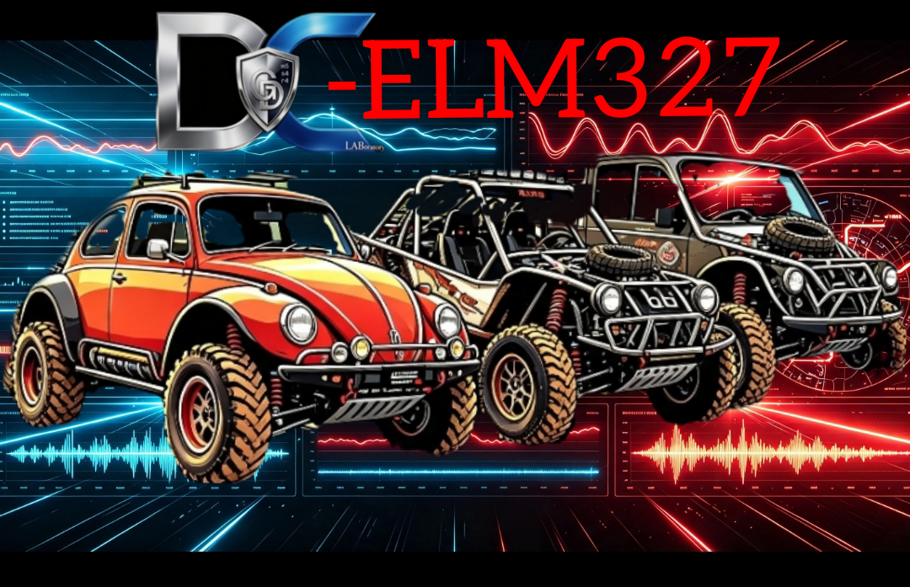

# 🚗 DC-ELM327 — Diagnóstico Automotriz

> **Monitoreo en tiempo real · Lectura de códigos · Comandos OBD-II**

---

## 🖼️ Portada

  

---

## 🛡️ Insignias y Estado

  
  
  
   
  
  
  
  
   
  
  
  
  
   
  
  

---

## 📲 Descargas de Aplicaciones

| # | Versión | Descripción | Enlace |
|---|---|---|---|
| 1 | 🚗 **DCtune — Principal** | Monitoreo completo, gráficas en tiempo real y lectura de códigos de falla | [📥 Descargar APK](https://github.com/dcg0/DCtunelm327/actions) |
| 2 | 🔧 **DC-ELM327 — Completo** | Conexión Bluetooth, panel personalizable, exportación CSV y escaneo de sensores | [📥 Descargar APK](https://github.com/dcg0/DC-ELM327/actions) |
| 3 | 🛠️ **DC-ELM327 HC — Avanzada** | Terminal de comandos AT, reportes en PDF y monitoreo profundo | [📥 Descargar Release](https://github.com/dcg0/DCtunelm327/releases) |
| 4 | ⚡ **DCcecuelm327 — Alternativa** | Versión optimizada, mayor compatibilidad con dispositivos | [📥 Descargar APK](https://github.com/dcg0/DCcecuelm327/actions) |

---

## 📄 Documentación Oficial

- 📚 **[Comandos AT y Códigos OBD-II (PDF)](Comandos_AT_ELM327_ES-1.pdf)**
  > Manual completo en español — Todos los comandos, códigos de falla y referencias para el módulo ELM327

---

## 🌐 Página Web Oficial

  
   
  👉 <strong>https://dcg0.github.io/DCtunelm327/</strong>

---

## 🔗 Proyectos y Enlaces Relacionados

  
  &nbsp;
  
  &nbsp;
  

---

## ⚙️ Características del Proyecto

- ✅ Conexión Bluetooth con módulos **ELM327 / OBD-II**
- ✅ Lectura de **códigos de falla** y borrado
- ✅ **Monitoreo en tiempo real** de sensores
- ✅ Generación de **reportes PDF**
- ✅ Exportación de datos en **CSV**
- ✅ Gráficas y **panel personalizable**
- ✅ Documentación completa en **español**

---

   
  <strong>© 2026 DCtune — Todos los derechos reservados</strong> 
  <em>Hecho con orgullo en México 🇲🇽</em>

